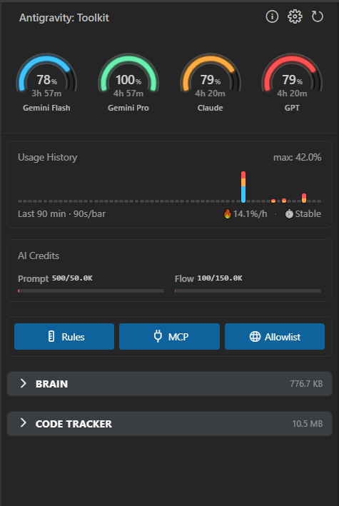
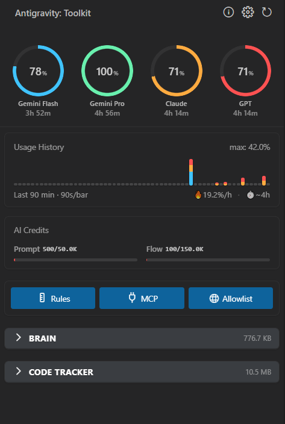
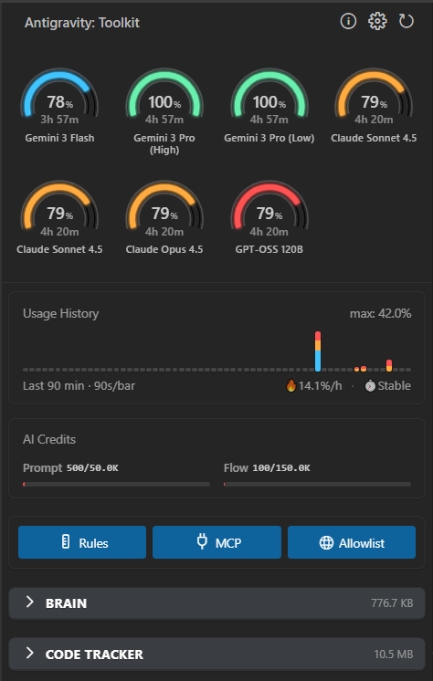
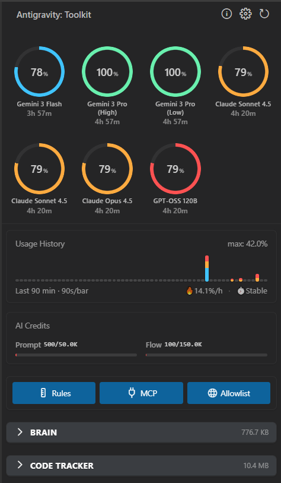

English | [中文文档](README_zh.md)

## 🔥 Now supporting Google's latest Gemini 3 Flash! Feedback welcome!

# Toolkit for Antigravity

> Monitor your AI quota usage and manage cache with ease

**Toolkit for Antigravity** (formerly *Antigravity Panel*) helps you stay on top of your AI model usage in **Google Antigravity IDE**. Get real-time quota monitoring, usage trends, and cache management—all within an integrated sidebar panel.

> **📢 Notice:** We have renamed from "Antigravity Panel" to "**Toolkit for Antigravity**" to better reflect our vision of building a comprehensive utility suite for the ecosystem. Same great features, just a more accurate name!

## ✨ Why Toolkit for Antigravity?

- 🎯 **Track your quota** - Real-time monitoring with visual warnings
- 📊 **Understand your usage** - Interactive charts showing usage trends
- 🧹 **Keep things clean** - Manage AI conversation caches with one click
- 🎨 **Elegant Interface** - Native theme integration with refined UI components
- 🌍 **Full Localization** - Support for 13 languages with runtime i18n notifications
- 🛠️ **Intelligent Diagnostics** - Built-in feedback system with automatic error reporting

## 📸 Screenshots

| | |
|:---:|:---:|
|  |  |\r\n|  |  |

*Real-time quota monitoring, usage trends, and cache management in one place*

## 🚀 Key Features

### 📊 Smart Quota Monitoring

**See your AI usage at a glance**
- Visual quota display grouped by AI model groups (Gemini, Claude, GPT, etc.)
- Status bar shows remaining quota with emoji indicators (🟢🟡🔴) and cache size
- Hover tooltip showing all model quotas and reset times
- Configurable warning (≤30%) and critical (≤10%) thresholds

### 📈 Usage Trends & Analytics

**Understand your consumption patterns**
- Interactive bar charts showing usage over time (10-120 minutes)
- 24-hour history tracking with persistent storage
- Color-coded visualization by AI model group
- 🔥 **Usage Rate**: Real-time consumption speed (%/hour)
- ⏱️ **Runway Prediction**: Estimated time until quota exhaustion

### 💳 Token Credits Tracking

**Monitor your AI usage credits**
- Prompt Credits: Used for conversation input and result generation (reasoning)
- Flow Credits: Used for search, modification, and command execution (operations)
- User info card visibility can be toggled in settings

### 🗂️ Cache Management

**Keep your workspace clean**
- **Brain Tasks**: Browse and delete AI conversation caches
  - See task size, file count, and creation date
  - Preview images, markdown, and code files
  - One-click deletion with automatic cleanup
- **Code Context**: Manage code analysis caches per project
- **Smart Cleanup**: Automatically closes related editor tabs

### 🤖 Auto-Accept (Hands-free Mode)

**Streamline your workflow**
- Automatically accepts Agent-suggested terminal commands and file edits
- Toggle on/off via the sidebar "Rocket" switch or command
- Ideal for rapid prototyping when you trust the Agent's output

### 🔄 Service Recovery Tools

**Built-in troubleshooting**
- **Restart**: Reboots the background Language Server if the Agent is unresponsive
- **Reset**: Clears user status cache to fix stuck quota updates
- **Reload**: Refreshes the VS Code window to resolve UI glitches

### ⚙️ Quick Configuration Access

**One-click shortcuts to important settings**
- Edit Global Rules
- Configure MCP settings
- Manage Browser Allowlist

### 🌐 Works Everywhere

**Cross-platform support**
- ✅ Windows
- ✅ macOS
- ✅ Linux

**Multi-language UI**
- English, 简体中文, 繁體中文, 日本語, Français, Deutsch, Español, Português (Brasil), Italiano, 한국어, Русский, Polski, Türkçe

## 📦 Installation

### Install from Extension Marketplace

1. Open **Antigravity IDE**
2. Press `Ctrl+Shift+X` (Windows/Linux) or `Cmd+Shift+X` (macOS) to open Extensions
3. Search for `Toolkit for Antigravity`
4. Click **Install**

**Or install from web:**
- [Extension Marketplace](https://marketplace.visualstudio.com/items?itemName=n2ns.antigravity-panel)
- [Open VSX Registry](https://open-vsx.org/extension/n2ns/antigravity-panel)

### Manual Install from GitHub Releases

If the marketplace is unavailable or you need a specific version:

1. Download the `.vsix` file from [GitHub Releases](https://github.com/n2ns/antigravity-panel/releases)
2. Open Antigravity IDE → Extensions panel
3. Click `⋯` (More Actions) → `Install from VSIX...`
4. Select the downloaded `.vsix` file

## 🎯 Quick Start

### Step 1: Open the Panel

Click the **Antigravity** icon in the sidebar, or:
- Press `Ctrl+Shift+P` (Windows/Linux) or `Cmd+Shift+P` (macOS)
- Type `Antigravity Toolkit: Open Panel`
- Press Enter

### Step 2: Monitor Your Quota

- **Pie charts** show quota by model family
- **Hover** over charts to see detailed limits
- **Status bar** displays active model quota and cache size
- **Usage chart** shows consumption trends

### Step 3: Manage Cache

- Expand **Brain** or **Code Tracker** sections
- Click 🗑️ to delete tasks or caches
- Related editor tabs close automatically

> ⚠️ **Note**: Deleting tasks removes conversation history and artifacts permanently.

## 🛠️ Available Commands

Open Command Palette (`Ctrl+Shift+P` / `Cmd+Shift+P`) and search for:

| Command | What it does |
|---------|-------------|
| `Antigravity Toolkit: Open Panel` | Open the sidebar panel |
| `Antigravity Toolkit: Refresh Quota` | Manually refresh quota data |
| `Antigravity Toolkit: Show Cache Size` | Show total cache size notification |
| `Antigravity Toolkit: Clean Cache` | Delete all cache data (use with caution!) |
| `Antigravity Toolkit: Open Settings` | Open extension settings |
| `Antigravity Toolkit: Show Disclaimer` | View privacy and safety disclaimer |
| `Antigravity Toolkit: Restart Language Server` | Restart Antigravity Agent Service |
| `Antigravity Toolkit: Reset User Status` | Reset the status updater |
| `Antigravity Toolkit: Run Diagnostics` | Run connectivity diagnostics |
| `Antigravity Toolkit: Toggle Auto-Accept` | Enable/Disable automatic command acceptance |

## ⚙️ Configuration

Open Settings (`Ctrl+,` / `Cmd+,`) in Antigravity IDE and search for `tfa` to customize:

### 📊 Quota Settings

| Setting | Default | Description |
|---------|---------|-------------|
| **Polling Interval** | `90s` | How often to refresh quota (min: 60s) |
| **Show Quota** | `✓` | Display quota in status bar |
| **Status Bar Style** | `percentage` | Display mode: percentage, resetTime, used, or remaining |
| **Quota Style** | `semi-arc` | Visualization style: `semi-arc` or `classic-donut` |
| **Visualization Mode** | `groups` | Show dashboard by `groups` or `models` |
| **Show GPT Quota** | `✗` | Whether to display GPT family models in the panel |
| **History Range** | `90 min` | Time range for usage chart (10-120 minutes) |
| **Warning Threshold** | `30%` | Status bar turns warning color at this level |
| **Critical Threshold** | `10%` | Status bar turns critical color at this level |

### 💾 Cache Settings

| Setting | Default | Description |
|---------|---------|-------------|
| **Show Cache Size** | `✓` | Display cache size in status bar |
| **Check Interval** | `120s` | How often to check cache size (30-600s) |
| **Warning Threshold** | `500 MB` | Status bar color warning when exceeded |
| **Hide Empty Folders** | `✗` | Hide empty folders in Brain and Code Tracker trees |
| **Auto Clean** | `✗` | Automatically clean cache when exceeded |
| **Auto Clean Keep Count** | `5` | Number of newest tasks to keep during auto-clean (1-50) |

### 🔧 Advanced Settings

| Setting | Default | Description |
|---------|---------|-------------|
| **Server Host** | `127.0.0.1` | Address of Antigravity Language Server |
| **API Path** | `/exa...` | gRPC-Web path for User Status |
| **Debug Mode** | `✗` | Enable verbose logging in Output panel |

## 🔒 Privacy & Safety Disclaimer

**Your data stays yours.**

Toolkit for Antigravity does not collect, transmit, or store any user data. All operations are performed locally on your machine. The extension only communicates with local components—nothing is sent to external servers.

**Experimental Feature Notice:**
The *Smart Quota Monitoring* feature relies on internal metrics exposed by the local Antigravity environment. This functionality is experimental and provided "as-is" to help users better understand their personal usage. It is not an official Google product and may be subject to changes in future IDE updates.

## 🤝 Contributing

We welcome contributions! If you find this toolkit helpful, please give us a **Star** 🌟 on GitHub! It's the best way to support our work and help others discover it.

Here's how you can help:

1. **Report bugs**: [Open an issue](https://github.com/n2ns/antigravity-panel/issues)
2. **Suggest features**: [Start a discussion](https://github.com/n2ns/antigravity-panel/discussions)
3. **Submit code**: Fork, code, test, and [open a PR](https://github.com/n2ns/antigravity-panel/pulls)

For major changes, please open an issue first to discuss your ideas.

## 🌐 Localization Policy

To ensure technical consistency and professional standard across all 13 supported languages:
- **UI Labels & Technical Terms**: Remain in **English** (e.g., `Rules`, `MCP`, `Auto-Accept`, `Reset Status`).
- **Tooltips & Descriptions**: Fully **localized** to provide detailed explanations in the user's native language.

For more details, see [LOCALIZATION_RULES.md](docs/LOCALIZATION_RULES.md).

## 📄 License

Licensed under the [Apache License, Version 2.0](LICENSE).

---

**Developed by [datafrog.io](https://datafrog.io)**

[Website](https://datafrog.io) · [Feedback & Support](https://github.com/n2ns/antigravity-panel/issues) · [Commercial Inquiry](mailto:support@datafrog.io)

*For Antigravity. By Antigravity.*

